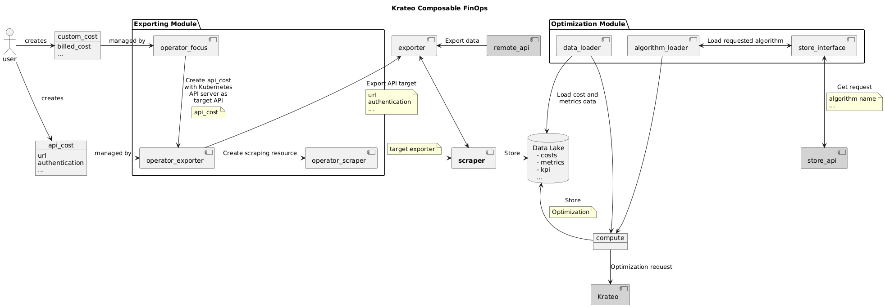

# FinOps Prometheus Scraper Generic
This repository is part of the wider exporting architecture for the Krateo Composable FinOps and scrapes Prometheus exporters to then upload the data to a data lake.

## Summary
1. [Overview](#overview)
2. [Architecture](#architecture)
3. [Configuration](#configuration)

## Overview
This component is tasked with scraping a given Prometheus endpoint. The configuration is obtained from a file mounted inside the container in "/config/config.yaml". The scraper uploads all the data to a Databricks database, as reported in the database-config field.

## Architecture


## Configuration
This container is automatically started by the operator-scraper.

To build the executable: 
```
make build REPO=<your-registry-here>
```

To build and push the Docker images:
```
make container REPO=<your-registry-here>
```

### Dependencies
There is the need to have an active CrateDB database, with the Krateo Database Service installed. Its login details must be placed in the database-config CR. 